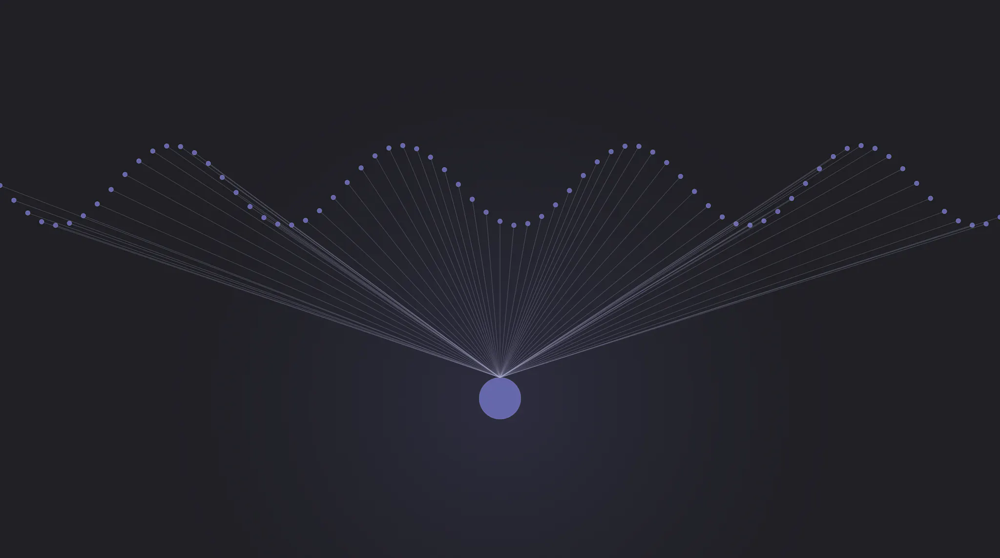
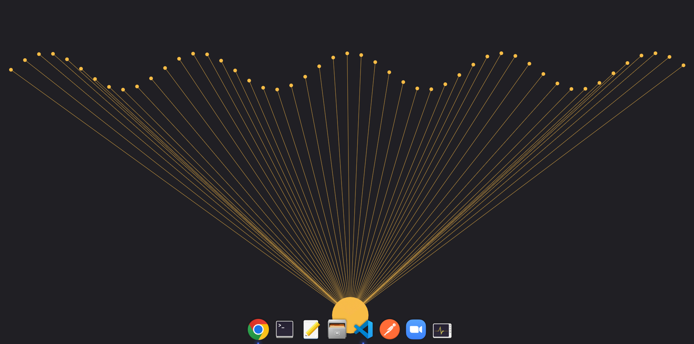

# <div align="center"> React Canvas MixPannel </div>

<div align="center">

React Canvas MixPannel <br>
리액트 캔버스를 연습하기 위해 작성한 글입니다. <br>

Canvas 연습을 위해 구글에 React Canvas 를 검색했더니 아래와 같은 사진이 나오게 되었습니다.



인터랙티브 한 모션과 그래픽으로 한 눈에 사로잡혔고, <br>
클론코딩을 하기 위해 먼저 Canvas 에 관련된 내용들을 공부하면서 작성해보았습니다. <br>  
위의 사진의 인터랙티브한 모션을 보고 싶다면 아래 링크를 눌러주세요.

https://blog.dalgu.app/examples/canvas/stage-lighting-wave

</div>

<br>

## RESULT



<br>

-   실행 방법

```bash
git clone https://github.com/libtv/react-canvas-mixpanel.git
cd react-canvas-mixpanel

npm install --save
npm start
```

<br>

간단하게 코드를 구성했으며 리팩토링 하지 않아서, 이해하기 쉬운 코드라고 생각합니다.

<br>

## REFERENCE

-   https://mixpanel.com/ko/
-   https://blog.dalgu.app/dev/1#5-requestAnimationFrame()-API-clearRect()-%EB%A9%94%EC%86%8C%EB%93%9C%EB%A1%9C-%EC%95%A0%EB%8B%88%EB%A9%94%EC%9D%B4%EC%85%98-%EB%8F%99%EC%9E%91%EC%8B%9C%ED%82%A4%EA%B8%B0
-   https://velog.io/@mokyoungg/React-React%EC%97%90%EC%84%9C-Canvas-%EC%82%AC%EC%9A%A9%ED%95%98%EA%B8%B0%EB%A7%88%EC%9A%B0%EC%8A%A4-%EA%B7%B8%EB%A6%AC%EA%B8%B0
-   https://www.youtube.com/watch?v=VyxrQ7-8QiY&ab_channel=%EC%88%98%EC%95%85%EC%A4%91%EB%8F%85
